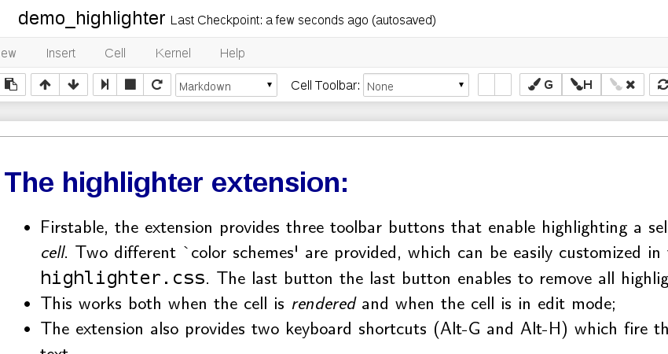

## The highlighter extension:

- Firstable, the extension provides three toolbar buttons that enable highlighting a selected text _within a markdown cell_. Two different \`color schemes' are provided, which can be easily customized in the stylesheet `highlighter.css`. The last button the last button enables to remove all highlightings in the current cell. 
- This works both when the cell is _rendered_ and when the cell is in edit mode; 
- In both modes, it is possible to highlight formatted portions of text (In rendered mode, since the selected text loose its formatting, an heuristic is applied to find the best alignment with the actual text)
- When no text is selected, the whole cell is highlighted; 
- The extension also provides two keyboard shortcuts (Alt-G and Alt-H) which fire the highlighting of the selected text. 




## Installation:

With Jupyter, you can simply issue
```bash
jupyter nbextension install https://rawgit.com/jfbercher/small_nbextensions/master/highlighter.zip  --user

```
at the command line.

### Testing: 

Use a code cell with
```javascript
%%javascript
require("base/js/utils").load_extensions("usability/highlighter/highlighter")
```

### Automatic load
You may also automatically load the extension for any notebook via
```bash
jupyter nbextension enable usability/highlighter/highlighter    
```
