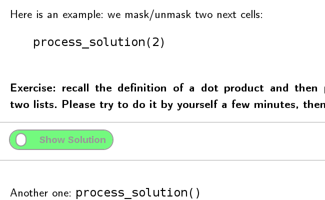

## interactive_sols extension:


This extension enable to hide or reveal several consecutive cells, using a small button. State of cells (hidden or not) and of the widget are saved in the notebook's metadata, which enable to restore the state of the notebook at (re)load. This extension is designed to let students work on a subject, before looking at tips or at the solution. The package provides both the javascript extension
- interactive_sols.js [the actual extension]
- interactive_sols.css [stylesheet where the widgets can be customized]
and a python file, which defines a function `process_solution` which defines the number of cells to mask:
- interactive_sols.py
This last file must be copied in the current directory or in a directory of the PYTHONPATH. 

It works as follows: either load the python function via a `%run`, or by loading `interactive_sols` as a module.

```python
%run interactive_sols.py
#or
from interactive_sols import process_solution, unhide_next_cell, unhide_all_cells
```


Then, the user can issue the command `process_solution(n)`, where `n` is an integer (n defaults to 1). In such case, the current cell with the process_solution command will be replaced by a (pretty) checkbox. Checking this checkbox will hide the n following cells. Some efforts have been done to ensure that the states (hidden/shown) of the cells as well as the checked state of checkboxes survive to reloads of the page, restarts of the kernel, and clear of cells outputs. 

Under the hood, the checkboxes are created with some lines of html/css, a counter for defining unique ids is implemented andstored in the notebook's metadata. 

Here is an example: we mask/unmask two next cells:
```
process_solution(2)
```


## Installation:

With Jupyter, you can simply issue
```bash
jupyter nbextension install https://rawgit.com/jfbercher/small_nbextensions/master/interactive_sols.zip  --user
```
at the command line.

### Testing: 

Use a code cell with
```javascript
%%javascript
require("base/js/utils").load_extensions("usability/interactive_sols/interactive_sols")
```
### Automatic load
You may also automatically load the extension for any notebook via
```bash
jupyter nbextension enable usability/interactive_sols/interactive_sols  
```